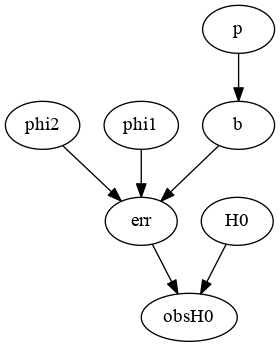
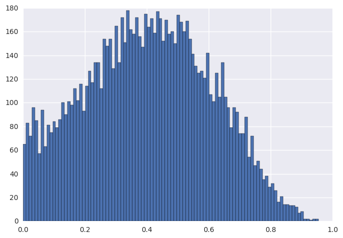
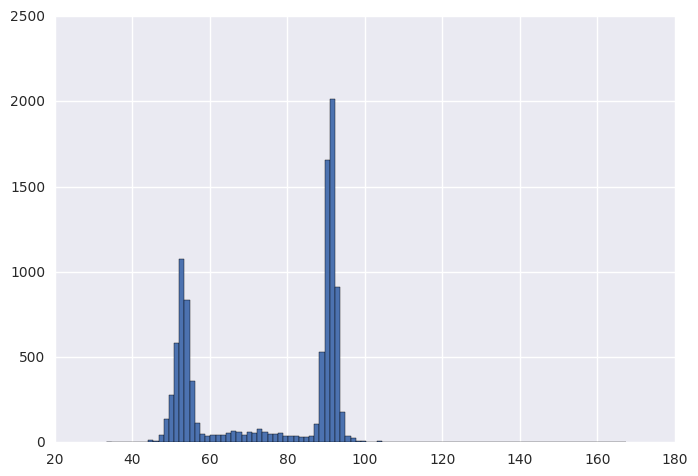
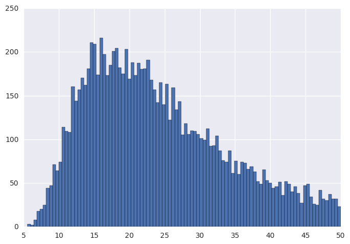
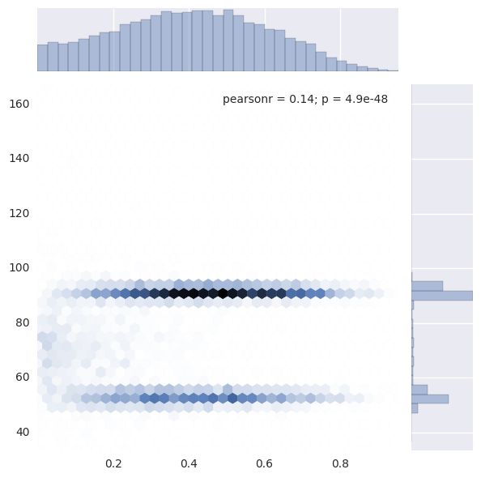
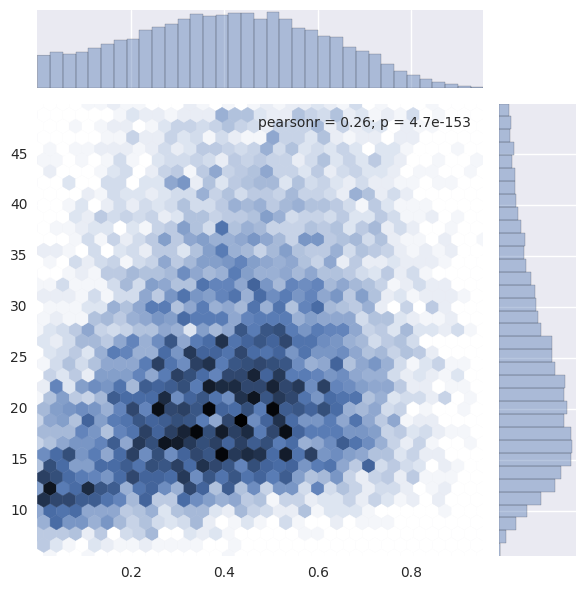
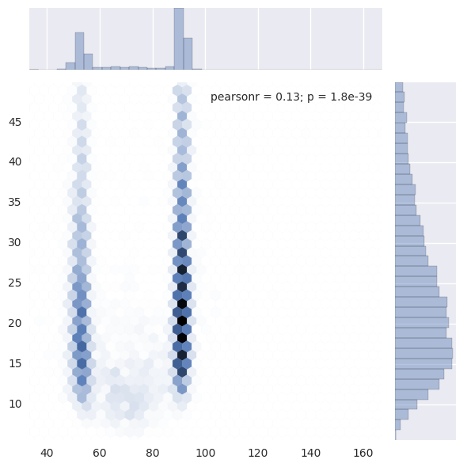

```python
%matplotlib inline
from mcupy.graph import *
from mcupy.utils import *
from mcupy.jagsparser import *
from mcupy.nodes import *
import scipy
import seaborn
import pylab
```


```python
data=parseJagsDataFile('data6.2.2.dat.R')
```


```python
obserr=data['obserr']
obsH0=data['obsH0']
```


```python
g=Graph()
p=FixedUniformNode(1e-6,1-1e-6).withTag('p')
phi1=ConstNode(1).withTag('phi1')
phi2=FixedUniformNode(1,50).withTag('phi2')
H0=FixedUniformNode(30,200).withTag('H0')
for i in range(0,len(obsH0)):
    b=BernNode(p).inGroup('b')
    err=CondNode(b,phi1,phi2)*ConstNode(obserr[i])
    err.inGroup("err")
    obsH0Node=NormalNode(H0,err).withObservedValue(obsH0[i])
    obsH0Node.inGroup('obsH0')
    g.addNode(obsH0Node)
```


```python
display_graph(g)
```





```python
for i in log_progress(range(0,1000)):
    g.sample()
    
results=[]
monP=g.getMonitor(p)
monH0=g.getMonitor(H0)
monPhi2=g.getMonitor(phi2)
for i in log_progress(range(0,10000)):
    g.sample()
    results.append([monP.get(),monH0.get(),monPhi2.get()])
```


```python
results=scipy.array(results)
```


```python
dummy=pylab.hist(results[:,0],bins=100)
```





```python
dummy=pylab.hist(results[:,1],bins=100)
```





```python
dummy=pylab.hist(results[:,2],bins=100)
```





```python
seaborn.jointplot(results[:,0],results[:,1],kind='hex')
```


    <seaborn.axisgrid.JointGrid at 0x7f92f2b38da0>





```python
seaborn.jointplot(results[:,0],results[:,2],kind='hex')
```


    <seaborn.axisgrid.JointGrid at 0x7f92f28f79b0>





```python
seaborn.jointplot(results[:,1],results[:,2],kind='hex')
```


    <seaborn.axisgrid.JointGrid at 0x7f92f2875780>





```python

```
