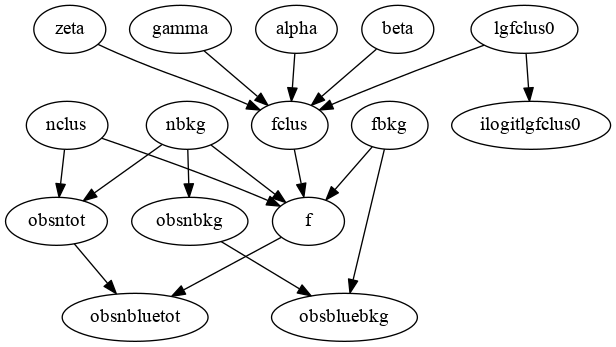
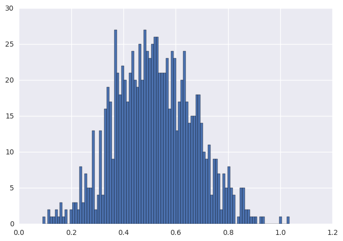
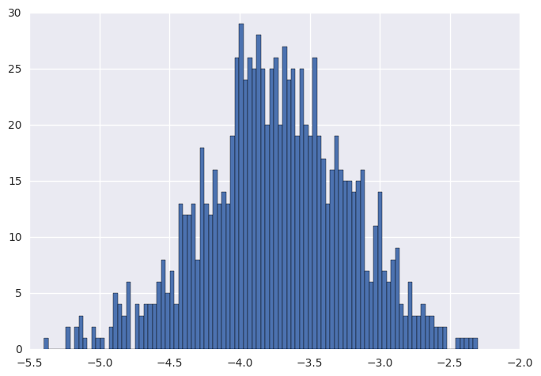
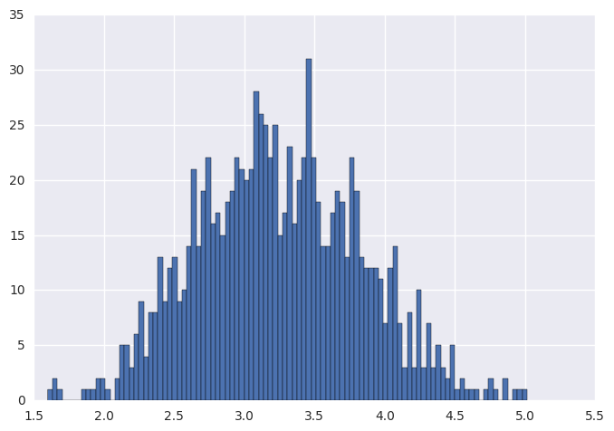

```python
%matplotlib inline
from mcupy.graph import *
from mcupy.utils import *
from mcupy.nodes import *
from mcupy.jagsparser import *
import seaborn,pylab,scipy,math
```

    /usr/lib/python3.5/site-packages/matplotlib/__init__.py:878: UserWarning: axes.color_cycle is deprecated and replaced with axes.prop_cycle; please use the latter.
      warnings.warn(self.msg_depr % (key, alt_key))


```python
data=parseJagsDataFile("8.5.R")
```


```python
g=Graph()
dataLength=len(data['z'])
lgfclus0=NormalNode(C_(0),C_(10)).withTag('lgfclus0')
alpha=NormalNode(C_(0),C_(10)).withTag('alpha')
beta=NormalNode(C_(0),C_(10)).withTag('beta')
gamma=NormalNode(C_(0),C_(10)).withTag('gamma')
zeta=NormalNode(C_(0),C_(10)).withTag('zeta')
ilogitlgfclus0=ILogitNode(lgfclus0).withTag('ilogitlgfclus0')
g.addNode(ilogitlgfclus0)
for i in range(0,dataLength):
    nbkg=FixedUniformNode(1,1e7).inGroup('nbkg')
    fbkg=BetaNode(1,1).inGroup('fbkg')
    nclus=FixedUniformNode(1,1e7).inGroup('nclus')

    obsnbkg=PoissonNode(nbkg).withObservedValue(data["obsnbkg"][i]).inGroup('obsnbkg')
    g.addNode(obsnbkg)

    obsbluebkg=BinNode(fbkg,obsnbkg).withObservedValue(data["obsnbluebkg"][i]).inGroup('obsbluebkg')
    g.addNode(obsbluebkg)

    obsntot=PoissonNode(nbkg/C_(data["C"][i])+nclus).withObservedValue(data["obsntot"][i]).inGroup('obsntot')
    g.addNode(obsntot)

    fclus=ILogitNode(lgfclus0+alpha*C_(math.log(data["r200"][i]/0.25))+beta*C_(data["lgM"][i]-11)+gamma*C_(data["z"][i]-0.3)+zeta*C_((data["lgM"][i]-11)*(data["z"][i]-0.3)))
    fclus.inGroup('fclus')
    f=(fbkg*nbkg/C_(data["C"][i])+fclus*nclus)/(nbkg/C_(data["C"][i])+nclus)
    f.inGroup('f')
    obsnbluetot=BinNode(f,obsntot).withObservedValue(data["obsnbluetot"][i]).inGroup('obsnbluetot')
    g.addNode(obsnbluetot)

```


```python
display_graph(g)
```





```python
ma=g.getMonitor(alpha)
mb=g.getMonitor(beta)
mg=g.getMonitor(gamma)
```


```python
results=[]
for i in log_progress(range(0,100)):
    g.sample()
    
for i in log_progress(range(0,1000)):
    g.sample()
    results.append([ma.get(),mb.get(),mg.get()])
results=scipy.array(results)
```


```python
dummy=pylab.hist(results[:,0],bins=100)
```





```python
dummy=pylab.hist(results[:,1],bins=100)
```





```python
dummy=pylab.hist(results[:,2],bins=100)
```





```python

```
