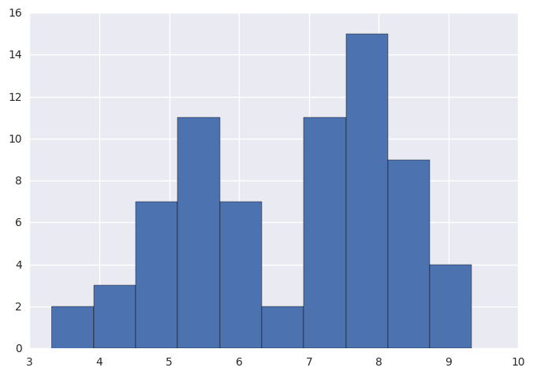
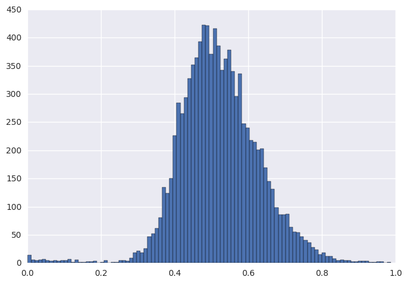
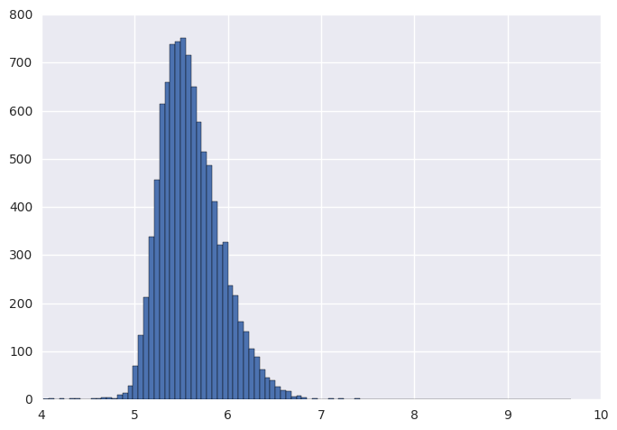
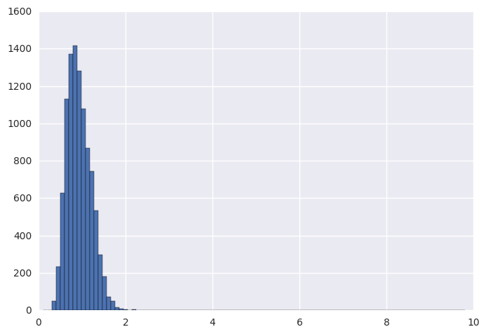
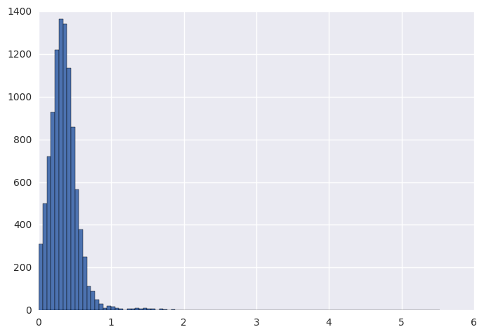

# A bimodal example
This is a sample to infer the parameters of a bimodal model, which is a mixture of two Normal distribution components.
The data is read from data6.2.1.dat.R, which is from 

First of course, import necessary packages.


```python
%matplotlib inline
from mcupy.graph import *
from mcupy.utils import *
from mcupy.nodes import *
from mcupy.jagsparser import *
import scipy
import seaborn
import pylab
```

    /usr/lib/python3.5/site-packages/matplotlib/__init__.py:878: UserWarning: axes.color_cycle is deprecated and replaced with axes.prop_cycle; please use the latter.
      warnings.warn(self.msg_depr % (key, alt_key))


Then read the data from a jags data file


```python
data=parseJagsDataFile('data6.2.1.dat.R')
obsval=data['obsval']
err=data['err']
```

Then Let's plot the histogram of the data.


```python
pylab.hist(obsval,bins=10)
```


    (array([  2.,   3.,   7.,  11.,   7.,   2.,  11.,  15.,   9.,   4.]),
     array([ 3.316 ,  3.9178,  4.5196,  5.1214,  5.7232,  6.325 ,  6.9268,
             7.5286,  8.1304,  8.7322,  9.334 ]),
     <a list of 10 Patch objects>)





Then compose the Bayesian network


```python
g=Graph()
p=FixedUniformNode(1e-5,1-1e-5).withTag("p")
sig1=FixedUniformNode(1e-10,10).withTag("sig1")
sig2=FixedUniformNode(1e-10,10).withTag("sig2")
cent1=FixedUniformNode(4,10).withTag("cent1")
cent2Upper=ConstNode(10+1e-6).withTag("cent2Upper")
cent2=UniformNode(cent1,cent2Upper).withTag("cent2")
for i in range(0,len(obsval)):
    b=BernNode(p).inGroup("b")
    cent=CondNode(b,cent1,cent2).inGroup("cent")
    sig=CondNode(b,sig1,sig2).inGroup("sig")
    val=NormalNode(cent,sig).inGroup("val")
    obsvalNode=NormalNode(val,ConstNode(err[i])).withObservedValue(obsval[i]).inGroup("obsval")
    g.addNode(obsvalNode)
```

Show the structure of the graph to check it.


```python
display_graph(g)
```


Declare some monitors to record the results.


```python
monP=g.getMonitor(p)
monCent1=g.getMonitor(cent1)
monCent2=g.getMonitor(cent2)
monSig1=g.getMonitor(sig1)
monSig2=g.getMonitor(sig2)
```

Burn 10000 times and sample 10000 times.


```python
results=[]
for i in log_progress(range(0,10000)):
    g.sample()
for i in log_progress(range(0,10000)):
    g.sample()
    results.append([monP.get(),monCent1.get(),monCent2.get(),monSig1.get(),monSig2.get()])
results=scipy.array(results)
```

Plot the results.


```python
pylab.hist(results[:,0],bins=100)
```


    (array([  14.,    6.,    5.,    6.,    7.,    5.,    3.,    4.,    3.,
               4.,    4.,    7.,    1.,    6.,    1.,    1.,    2.,    2.,
               3.,    0.,    1.,    4.,    0.,    1.,    1.,    4.,    4.,
               3.,    9.,   18.,   21.,   18.,   26.,   47.,   52.,   61.,
              81.,  134.,  124.,  150.,  226.,  284.,  265.,  294.,  328.,
             352.,  365.,  393.,  423.,  421.,  371.,  416.,  386.,  342.,
             362.,  378.,  340.,  296.,  336.,  247.,  240.,  218.,  215.,
             201.,  203.,  169.,  145.,  131.,   99.,   86.,   86.,   87.,
              64.,   55.,   54.,   47.,   40.,   36.,   28.,   23.,   15.,
              18.,   12.,   12.,    8.,    4.,    6.,    5.,    5.,    2.,
               2.,    3.,    3.,    3.,    1.,    1.,    2.,    2.,    0.,    1.]),
     array([  9.72958308e-04,   1.08351179e-02,   2.06972775e-02,
              3.05594371e-02,   4.04215967e-02,   5.02837563e-02,
              6.01459159e-02,   7.00080755e-02,   7.98702351e-02,
              8.97323947e-02,   9.95945543e-02,   1.09456714e-01,
              1.19318873e-01,   1.29181033e-01,   1.39043193e-01,
              1.48905352e-01,   1.58767512e-01,   1.68629671e-01,
              1.78491831e-01,   1.88353991e-01,   1.98216150e-01,
              2.08078310e-01,   2.17940469e-01,   2.27802629e-01,
              2.37664789e-01,   2.47526948e-01,   2.57389108e-01,
              2.67251267e-01,   2.77113427e-01,   2.86975587e-01,
              2.96837746e-01,   3.06699906e-01,   3.16562065e-01,
              3.26424225e-01,   3.36286385e-01,   3.46148544e-01,
              3.56010704e-01,   3.65872863e-01,   3.75735023e-01,
              3.85597183e-01,   3.95459342e-01,   4.05321502e-01,
              4.15183661e-01,   4.25045821e-01,   4.34907981e-01,
              4.44770140e-01,   4.54632300e-01,   4.64494459e-01,
              4.74356619e-01,   4.84218779e-01,   4.94080938e-01,
              5.03943098e-01,   5.13805257e-01,   5.23667417e-01,
              5.33529576e-01,   5.43391736e-01,   5.53253896e-01,
              5.63116055e-01,   5.72978215e-01,   5.82840374e-01,
              5.92702534e-01,   6.02564694e-01,   6.12426853e-01,
              6.22289013e-01,   6.32151172e-01,   6.42013332e-01,
              6.51875492e-01,   6.61737651e-01,   6.71599811e-01,
              6.81461970e-01,   6.91324130e-01,   7.01186290e-01,
              7.11048449e-01,   7.20910609e-01,   7.30772768e-01,
              7.40634928e-01,   7.50497088e-01,   7.60359247e-01,
              7.70221407e-01,   7.80083566e-01,   7.89945726e-01,
              7.99807886e-01,   8.09670045e-01,   8.19532205e-01,
              8.29394364e-01,   8.39256524e-01,   8.49118684e-01,
              8.58980843e-01,   8.68843003e-01,   8.78705162e-01,
              8.88567322e-01,   8.98429482e-01,   9.08291641e-01,
              9.18153801e-01,   9.28015960e-01,   9.37878120e-01,
              9.47740280e-01,   9.57602439e-01,   9.67464599e-01,
              9.77326758e-01,   9.87188918e-01]),
     <a list of 100 Patch objects>)





```python
pylab.hist(results[:,1],bins=100)
```


    (array([   2.,    2.,    0.,    2.,    1.,    2.,    2.,    0.,    0.,
               2.,    3.,    5.,    5.,    2.,    9.,   13.,   29.,   70.,
             133.,  213.,  339.,  457.,  615.,  659.,  738.,  743.,  752.,
             715.,  649.,  576.,  514.,  486.,  412.,  322.,  327.,  237.,
             217.,  161.,  141.,  105.,   88.,   63.,   45.,   39.,   26.,
              20.,   17.,    7.,    8.,    4.,    1.,    2.,    1.,    1.,
               2.,    0.,    2.,    0.,    0.,    3.,    0.,    1.,    1.,
               0.,    1.,    0.,    0.,    1.,    0.,    0.,    1.,    0.,
               0.,    0.,    0.,    1.,    0.,    1.,    1.,    0.,    0.,
               0.,    1.,    0.,    0.,    1.,    0.,    0.,    0.,    0.,
               0.,    0.,    0.,    0.,    0.,    0.,    0.,    0.,    0.,    1.]),
     array([ 4.01907795,  4.075643  ,  4.13220804,  4.18877309,  4.24533813,
             4.30190318,  4.35846822,  4.41503327,  4.47159831,  4.52816335,
             4.5847284 ,  4.64129344,  4.69785849,  4.75442353,  4.81098858,
             4.86755362,  4.92411867,  4.98068371,  5.03724876,  5.0938138 ,
             5.15037885,  5.20694389,  5.26350893,  5.32007398,  5.37663902,
             5.43320407,  5.48976911,  5.54633416,  5.6028992 ,  5.65946425,
             5.71602929,  5.77259434,  5.82915938,  5.88572443,  5.94228947,
             5.99885451,  6.05541956,  6.1119846 ,  6.16854965,  6.22511469,
             6.28167974,  6.33824478,  6.39480983,  6.45137487,  6.50793992,
             6.56450496,  6.62107001,  6.67763505,  6.7342001 ,  6.79076514,
             6.84733018,  6.90389523,  6.96046027,  7.01702532,  7.07359036,
             7.13015541,  7.18672045,  7.2432855 ,  7.29985054,  7.35641559,
             7.41298063,  7.46954568,  7.52611072,  7.58267576,  7.63924081,
             7.69580585,  7.7523709 ,  7.80893594,  7.86550099,  7.92206603,
             7.97863108,  8.03519612,  8.09176117,  8.14832621,  8.20489126,
             8.2614563 ,  8.31802134,  8.37458639,  8.43115143,  8.48771648,
             8.54428152,  8.60084657,  8.65741161,  8.71397666,  8.7705417 ,
             8.82710675,  8.88367179,  8.94023684,  8.99680188,  9.05336693,
             9.10993197,  9.16649701,  9.22306206,  9.2796271 ,  9.33619215,
             9.39275719,  9.44932224,  9.50588728,  9.56245233,  9.61901737,
             9.67558242]),
     <a list of 100 Patch objects>)





```python
pylab.hist(results[:,2],bins=100)
```


    (array([  1.00000000e+00,   1.00000000e+00,   0.00000000e+00,
              0.00000000e+00,   1.00000000e+00,   2.00000000e+00,
              4.00000000e+00,   5.00000000e+00,   3.00000000e+00,
              1.00000000e+00,   2.00000000e+00,   3.00000000e+00,
              2.00000000e+00,   4.00000000e+00,   4.00000000e+00,
              5.00000000e+00,   4.00000000e+00,   2.00000000e+00,
              3.00000000e+00,   4.00000000e+00,   1.00000000e+00,
              3.00000000e+00,   4.00000000e+00,   6.00000000e+00,
              4.00000000e+00,   1.00000000e+00,   4.00000000e+00,
              8.00000000e+00,   6.00000000e+00,   6.00000000e+00,
              1.00000000e+01,   8.00000000e+00,   9.00000000e+00,
              1.10000000e+01,   1.70000000e+01,   1.70000000e+01,
              2.80000000e+01,   5.20000000e+01,   7.00000000e+01,
              1.12000000e+02,   1.73000000e+02,   2.45000000e+02,
              3.44000000e+02,   5.22000000e+02,   6.81000000e+02,
              8.12000000e+02,   8.84000000e+02,   1.02400000e+03,
              1.06000000e+03,   8.82000000e+02,   8.41000000e+02,
              6.32000000e+02,   4.63000000e+02,   3.62000000e+02,
              2.71000000e+02,   1.48000000e+02,   9.20000000e+01,
              4.80000000e+01,   3.50000000e+01,   1.50000000e+01,
              8.00000000e+00,   4.00000000e+00,   8.00000000e+00,
              3.00000000e+00,   0.00000000e+00,   3.00000000e+00,
              1.00000000e+00,   1.00000000e+00,   3.00000000e+00,
              2.00000000e+00,   0.00000000e+00,   0.00000000e+00,
              0.00000000e+00,   2.00000000e+00,   0.00000000e+00,
              0.00000000e+00,   0.00000000e+00,   0.00000000e+00,
              0.00000000e+00,   0.00000000e+00,   0.00000000e+00,
              0.00000000e+00,   0.00000000e+00,   0.00000000e+00,
              0.00000000e+00,   0.00000000e+00,   0.00000000e+00,
              0.00000000e+00,   0.00000000e+00,   0.00000000e+00,
              0.00000000e+00,   0.00000000e+00,   1.00000000e+00,
              0.00000000e+00,   1.00000000e+00,   0.00000000e+00,
              0.00000000e+00,   0.00000000e+00,   0.00000000e+00,
              1.00000000e+00]),
     array([ 6.39564876,  6.42913475,  6.46262075,  6.49610674,  6.52959273,
             6.56307873,  6.59656472,  6.63005071,  6.66353671,  6.6970227 ,
             6.7305087 ,  6.76399469,  6.79748068,  6.83096668,  6.86445267,
             6.89793866,  6.93142466,  6.96491065,  6.99839665,  7.03188264,
             7.06536863,  7.09885463,  7.13234062,  7.16582661,  7.19931261,
             7.2327986 ,  7.26628459,  7.29977059,  7.33325658,  7.36674258,
             7.40022857,  7.43371456,  7.46720056,  7.50068655,  7.53417254,
             7.56765854,  7.60114453,  7.63463053,  7.66811652,  7.70160251,
             7.73508851,  7.7685745 ,  7.80206049,  7.83554649,  7.86903248,
             7.90251847,  7.93600447,  7.96949046,  8.00297646,  8.03646245,
             8.06994844,  8.10343444,  8.13692043,  8.17040642,  8.20389242,
             8.23737841,  8.27086441,  8.3043504 ,  8.33783639,  8.37132239,
             8.40480838,  8.43829437,  8.47178037,  8.50526636,  8.53875236,
             8.57223835,  8.60572434,  8.63921034,  8.67269633,  8.70618232,
             8.73966832,  8.77315431,  8.8066403 ,  8.8401263 ,  8.87361229,
             8.90709829,  8.94058428,  8.97407027,  9.00755627,  9.04104226,
             9.07452825,  9.10801425,  9.14150024,  9.17498624,  9.20847223,
             9.24195822,  9.27544422,  9.30893021,  9.3424162 ,  9.3759022 ,
             9.40938819,  9.44287418,  9.47636018,  9.50984617,  9.54333217,
             9.57681816,  9.61030415,  9.64379015,  9.67727614,  9.71076213,
             9.74424813]),
     <a list of 100 Patch objects>)


```python
pylab.hist(results[:,3],bins=100)
```


    (array([  1.00000000e+00,   2.00000000e+00,   5.00000000e+01,
              2.33000000e+02,   6.27000000e+02,   1.13000000e+03,
              1.37300000e+03,   1.41500000e+03,   1.28100000e+03,
              1.07800000e+03,   8.70000000e+02,   7.46000000e+02,
              5.34000000e+02,   2.96000000e+02,   1.80000000e+02,
              7.30000000e+01,   4.80000000e+01,   1.50000000e+01,
              9.00000000e+00,   4.00000000e+00,   2.00000000e+00,
              5.00000000e+00,   2.00000000e+00,   0.00000000e+00,
              1.00000000e+00,   1.00000000e+00,   2.00000000e+00,
              2.00000000e+00,   1.00000000e+00,   0.00000000e+00,
              0.00000000e+00,   1.00000000e+00,   1.00000000e+00,
              0.00000000e+00,   0.00000000e+00,   0.00000000e+00,
              1.00000000e+00,   0.00000000e+00,   0.00000000e+00,
              0.00000000e+00,   2.00000000e+00,   1.00000000e+00,
              0.00000000e+00,   1.00000000e+00,   0.00000000e+00,
              1.00000000e+00,   0.00000000e+00,   0.00000000e+00,
              0.00000000e+00,   0.00000000e+00,   0.00000000e+00,
              1.00000000e+00,   1.00000000e+00,   0.00000000e+00,
              1.00000000e+00,   1.00000000e+00,   1.00000000e+00,
              0.00000000e+00,   0.00000000e+00,   0.00000000e+00,
              0.00000000e+00,   0.00000000e+00,   0.00000000e+00,
              0.00000000e+00,   0.00000000e+00,   2.00000000e+00,
              0.00000000e+00,   0.00000000e+00,   0.00000000e+00,
              0.00000000e+00,   0.00000000e+00,   0.00000000e+00,
              0.00000000e+00,   0.00000000e+00,   0.00000000e+00,
              0.00000000e+00,   0.00000000e+00,   0.00000000e+00,
              0.00000000e+00,   0.00000000e+00,   0.00000000e+00,
              0.00000000e+00,   1.00000000e+00,   0.00000000e+00,
              0.00000000e+00,   0.00000000e+00,   0.00000000e+00,
              0.00000000e+00,   0.00000000e+00,   0.00000000e+00,
              0.00000000e+00,   1.00000000e+00,   0.00000000e+00,
              1.00000000e+00,   0.00000000e+00,   0.00000000e+00,
              0.00000000e+00,   0.00000000e+00,   0.00000000e+00,
              1.00000000e+00]),
     array([ 0.1060736 ,  0.20311661,  0.30015961,  0.39720261,  0.49424562,
             0.59128862,  0.68833162,  0.78537463,  0.88241763,  0.97946064,
             1.07650364,  1.17354664,  1.27058965,  1.36763265,  1.46467565,
             1.56171866,  1.65876166,  1.75580466,  1.85284767,  1.94989067,
             2.04693367,  2.14397668,  2.24101968,  2.33806268,  2.43510569,
             2.53214869,  2.62919169,  2.7262347 ,  2.8232777 ,  2.9203207 ,
             3.01736371,  3.11440671,  3.21144972,  3.30849272,  3.40553572,
             3.50257873,  3.59962173,  3.69666473,  3.79370774,  3.89075074,
             3.98779374,  4.08483675,  4.18187975,  4.27892275,  4.37596576,
             4.47300876,  4.57005176,  4.66709477,  4.76413777,  4.86118077,
             4.95822378,  5.05526678,  5.15230978,  5.24935279,  5.34639579,
             5.44343879,  5.5404818 ,  5.6375248 ,  5.73456781,  5.83161081,
             5.92865381,  6.02569682,  6.12273982,  6.21978282,  6.31682583,
             6.41386883,  6.51091183,  6.60795484,  6.70499784,  6.80204084,
             6.89908385,  6.99612685,  7.09316985,  7.19021286,  7.28725586,
             7.38429886,  7.48134187,  7.57838487,  7.67542787,  7.77247088,
             7.86951388,  7.96655688,  8.06359989,  8.16064289,  8.2576859 ,
             8.3547289 ,  8.4517719 ,  8.54881491,  8.64585791,  8.74290091,
             8.83994392,  8.93698692,  9.03402992,  9.13107293,  9.22811593,
             9.32515893,  9.42220194,  9.51924494,  9.61628794,  9.71333095,
             9.81037395]),
     <a list of 100 Patch objects>)





```python
pylab.hist(results[:,4],bins=100)
```


    (array([  3.10000000e+02,   5.01000000e+02,   7.21000000e+02,
              9.27000000e+02,   1.22000000e+03,   1.36500000e+03,
              1.34200000e+03,   1.13300000e+03,   8.57000000e+02,
              5.66000000e+02,   3.78000000e+02,   2.52000000e+02,
              1.14000000e+02,   8.80000000e+01,   4.90000000e+01,
              2.90000000e+01,   1.20000000e+01,   1.90000000e+01,
              1.70000000e+01,   1.00000000e+01,   6.00000000e+00,
              0.00000000e+00,   8.00000000e+00,   9.00000000e+00,
              1.00000000e+01,   7.00000000e+00,   1.00000000e+01,
              6.00000000e+00,   6.00000000e+00,   2.00000000e+00,
              6.00000000e+00,   5.00000000e+00,   1.00000000e+00,
              3.00000000e+00,   2.00000000e+00,   2.00000000e+00,
              0.00000000e+00,   0.00000000e+00,   1.00000000e+00,
              0.00000000e+00,   1.00000000e+00,   0.00000000e+00,
              1.00000000e+00,   0.00000000e+00,   1.00000000e+00,
              1.00000000e+00,   0.00000000e+00,   0.00000000e+00,
              0.00000000e+00,   0.00000000e+00,   0.00000000e+00,
              0.00000000e+00,   0.00000000e+00,   0.00000000e+00,
              0.00000000e+00,   1.00000000e+00,   0.00000000e+00,
              0.00000000e+00,   0.00000000e+00,   0.00000000e+00,
              0.00000000e+00,   0.00000000e+00,   0.00000000e+00,
              0.00000000e+00,   0.00000000e+00,   0.00000000e+00,
              0.00000000e+00,   0.00000000e+00,   0.00000000e+00,
              0.00000000e+00,   0.00000000e+00,   0.00000000e+00,
              0.00000000e+00,   0.00000000e+00,   0.00000000e+00,
              0.00000000e+00,   0.00000000e+00,   0.00000000e+00,
              0.00000000e+00,   0.00000000e+00,   0.00000000e+00,
              0.00000000e+00,   0.00000000e+00,   0.00000000e+00,
              0.00000000e+00,   0.00000000e+00,   0.00000000e+00,
              0.00000000e+00,   0.00000000e+00,   0.00000000e+00,
              0.00000000e+00,   0.00000000e+00,   0.00000000e+00,
              0.00000000e+00,   0.00000000e+00,   0.00000000e+00,
              0.00000000e+00,   0.00000000e+00,   0.00000000e+00,
              1.00000000e+00]),
     array([  4.01931164e-03,   5.92796564e-02,   1.14540001e-01,
              1.69800346e-01,   2.25060691e-01,   2.80321036e-01,
              3.35581380e-01,   3.90841725e-01,   4.46102070e-01,
              5.01362415e-01,   5.56622760e-01,   6.11883104e-01,
              6.67143449e-01,   7.22403794e-01,   7.77664139e-01,
              8.32924484e-01,   8.88184828e-01,   9.43445173e-01,
              9.98705518e-01,   1.05396586e+00,   1.10922621e+00,
              1.16448655e+00,   1.21974690e+00,   1.27500724e+00,
              1.33026759e+00,   1.38552793e+00,   1.44078828e+00,
              1.49604862e+00,   1.55130897e+00,   1.60656931e+00,
              1.66182966e+00,   1.71709000e+00,   1.77235035e+00,
              1.82761069e+00,   1.88287103e+00,   1.93813138e+00,
              1.99339172e+00,   2.04865207e+00,   2.10391241e+00,
              2.15917276e+00,   2.21443310e+00,   2.26969345e+00,
              2.32495379e+00,   2.38021414e+00,   2.43547448e+00,
              2.49073483e+00,   2.54599517e+00,   2.60125552e+00,
              2.65651586e+00,   2.71177621e+00,   2.76703655e+00,
              2.82229690e+00,   2.87755724e+00,   2.93281759e+00,
              2.98807793e+00,   3.04333828e+00,   3.09859862e+00,
              3.15385896e+00,   3.20911931e+00,   3.26437965e+00,
              3.31964000e+00,   3.37490034e+00,   3.43016069e+00,
              3.48542103e+00,   3.54068138e+00,   3.59594172e+00,
              3.65120207e+00,   3.70646241e+00,   3.76172276e+00,
              3.81698310e+00,   3.87224345e+00,   3.92750379e+00,
              3.98276414e+00,   4.03802448e+00,   4.09328483e+00,
              4.14854517e+00,   4.20380552e+00,   4.25906586e+00,
              4.31432621e+00,   4.36958655e+00,   4.42484690e+00,
              4.48010724e+00,   4.53536758e+00,   4.59062793e+00,
              4.64588827e+00,   4.70114862e+00,   4.75640896e+00,
              4.81166931e+00,   4.86692965e+00,   4.92219000e+00,
              4.97745034e+00,   5.03271069e+00,   5.08797103e+00,
              5.14323138e+00,   5.19849172e+00,   5.25375207e+00,
              5.30901241e+00,   5.36427276e+00,   5.41953310e+00,
              5.47479345e+00,   5.53005379e+00]),
     <a list of 100 Patch objects>)





```python
seaborn.jointplot(results[:,1],results[:,2],kind='hex')
```

    /usr/lib/python3.5/site-packages/matplotlib/__init__.py:898: UserWarning: axes.color_cycle is deprecated and replaced with axes.prop_cycle; please use the latter.
      warnings.warn(self.msg_depr % (key, alt_key))


    <seaborn.axisgrid.JointGrid at 0x7fac74aa43c8>


```python
seaborn.jointplot(results[:,0],results[:,1],kind='hex')
```

    /usr/lib/python3.5/site-packages/matplotlib/__init__.py:898: UserWarning: axes.color_cycle is deprecated and replaced with axes.prop_cycle; please use the latter.
      warnings.warn(self.msg_depr % (key, alt_key))


    <seaborn.axisgrid.JointGrid at 0x7fac74969a20>


```python

```
